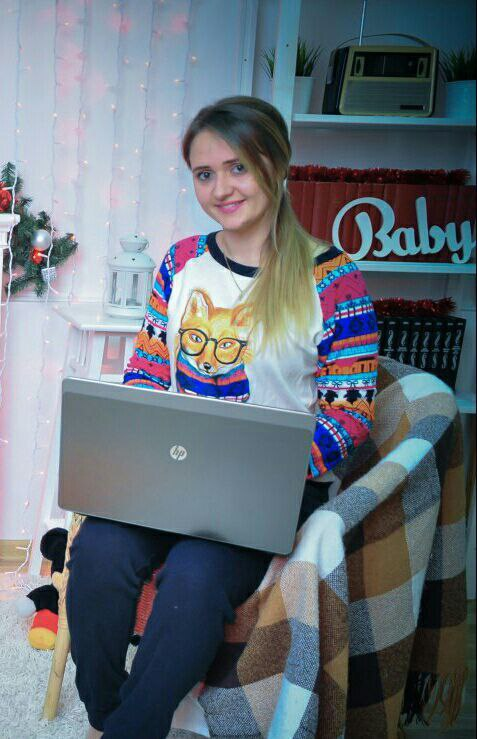

**Обо мне**

Меня зовут Валерия, я учусь на курсе Пайтон разработчик в Нетологии. 
Мне нравится разбираться в деталях, докапываться до сути и искать лучшие варианты решений тех или иных задач. Сейчас, мне сложно, потому что раньше я никак не была связана со сферой IT, но мне очень интересно и я не боюсь сложностей. Считаю, неразрешимых задач не бывает, бывает недостаток информации. 

**В свободное время я**
- слушаю/читаю художественную историческую литературу
- танцую
- пью вкусный кофе  
